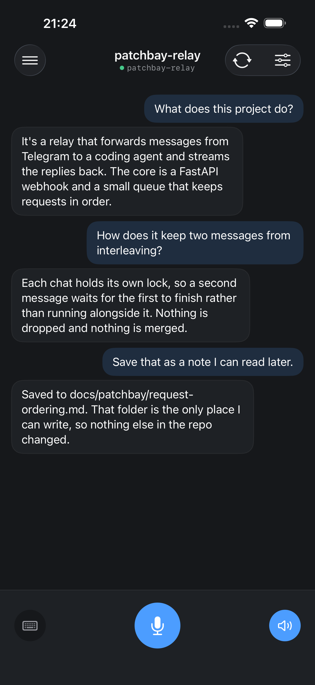
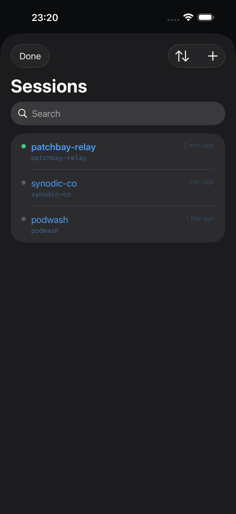
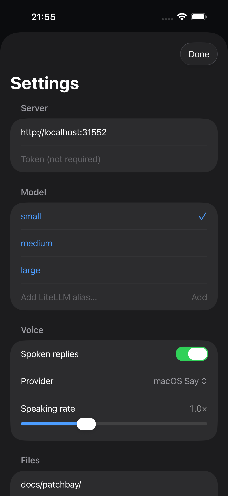

# Patchbay Voice

Voice interface to your codebase, powered by [pi](https://github.com/earendil-works/pi), a multi-model AI coding agent. Speak into your phone (or browser), ask about your code, hear the answer, and have it save notes for you.

 

<p align="center">
  
  
  
</p>

## What it is

A two-part system: an iOS app and a server that runs alongside pi on a machine you control (macOS or Linux, local or remote).

You hold a button and ask about a project: what it does, how a piece works, what changed in the last commit. The server transcribes it with faster-whisper, sends it to pi (via a custom extension bundled in the repo), and streams the spoken answer back. The agent can read files, search, and inspect git history, and it can save notes to a locked folder in the repo, but it does not modify your code. The whole exchange is stored per-session so context accumulates across turns.

Two clients ship with the repo: a native iOS app and a single-file web client served directly by the server at `GET /`. Both share the same API.

## Design: a turn always comes back with something audible

A voice interface is used when you are *not* looking at the screen: walking, hands busy, phone in a pocket. That single fact changes what a failure is allowed to do: a silent app leaves you waiting on the sidewalk for a reply that never comes, with no way to tell it broke. So the server is built on one rule: **every turn returns something you can hear.** The decisions that follow from it were easy to leave implicit until voice forced them, so they are written down as [architecture decision records](docs/adr/) and tested against, not buried in the code:

- **[Audio is best-effort, never required](docs/adr/0001-tts-fallback-chain.md).** The transcript and reply text are the permanent record; spoken audio is a disposable rendering. Synthesis runs a one-way fallback chain (Google Cloud TTS → local `say`/`espeak`/`piper` → a pre-recorded "audio unavailable" clip) and flags when it had to fall back.
- **[Failures speak](docs/adr/0003-failed-turn-persistence-and-audio.md).** If pi times out or transcription fails, the turn is still saved and a short spoken notice comes back through that same chain. The technical detail stays in the turn's text; what you *hear* is a plain sentence.
- **[Nothing you say is dropped](docs/adr/0002-turn-submission-queue.md).** Talking while a previous turn is still running used to block or discard the earlier message. Now every submission is queued server-side in strict FIFO order and answered as its own turn.
- **[Audio is ephemeral on purpose](docs/adr/0005-audio-lifetime.md).** A turn's audio lives only until the next turn on that chat, then it's deleted. This is a live conversation, not a podcast archive.

## Architecture

```
iOS app or web client (GET / → web/index.html)
  └── Hold to talk / type a message
      └── POST /api/talk → server
            ├── faster-whisper (local transcription)
            ├── pi --print --mode json --session <id> --extension pi/tools.ts
            └── Google Cloud TTS or macOS say (audio response)
                └── Audio chunks streamed back to client
```

Sessions map one-to-one to directories under `~/Developer`. Each session carries a pi session ID so pi maintains context across turns.

## System Requirements

- **macOS or Linux** (the server host, local or remote)
- **[pi](https://github.com/earendil-works/pi)** coding agent in `$PATH` (`pi` binary)
- **[uv](https://github.com/astral-sh/uv)** for Python dependency management
- **[Node.js](https://nodejs.org)** (required by pi to load the TypeScript extension)
- **faster-whisper** (bundled via uv, no manual install)
- **Google Cloud service account** with Text-to-Speech API enabled (optional; falls back to a local voice: macOS `say`, or `espeak`/`piper` on Linux)

## Server

```bash
cd server
uv sync
uv run uvicorn app:app
```

Or use the convenience wrapper:

```bash
cd server
./run.sh
```

Runs on port 31552 by default. Configure with environment variables:

| Variable | Default | Description |
|---|---|---|
| `VOICE_HOST` | `127.0.0.1` | Bind address |
| `VOICE_PORT` | `31552` | Port |
| `VOICE_AUTH_TOKEN` | *(empty, auth off)* | Optional bearer token required on `/api/*` when set |
| `PI_BIN` | `pi` | Path to pi binary |
| `PI_PROVIDER` | `litellm` | pi model provider |
| `PI_MODEL` | `small` | pi model alias |
| `DEVELOPER_DIR` | `~/Developer` | Root for project sessions |
| `WHISPER_MODEL` | `base.en` | faster-whisper model size |
| `TTS_VOICE` | `Samantha` | macOS say voice name |
| `TTS_SPEAKING_RATE` | `1.0` | Default speaking rate (0.5–2.0) |
| `GOOGLE_TTS_VOICE` | `en-US-Chirp3-HD-Schedar` | Google Cloud TTS voice |
| `GOOGLE_TTS_SERVICE_ACCOUNT_JSON` | *(from pass)* | Google service account JSON string |
| `GOOGLE_TTS_SERVICE_ACCOUNT_FILE` | *(unset)* | Path to the Google service-account JSON file (for Linux boxes with no `pass`) |
| `LOCAL_TTS_ENGINE` | *(auto)* | Force the local engine: `say`, `piper`, or `espeak` (auto-detects when unset) |
| `VOICE_FORCE_MODEL` | *(unset)* | Pin the pi model server-side, ignoring the client's request (demo / locked-down servers) |
| `VOICE_FORCE_TTS` | *(unset)* | Pin the TTS provider server-side (e.g. `google`), ignoring the client's request |
| `VOICE_ONDEVICE_PROJECTS` | *(unset)* | Comma-separated project dirs for which the server returns no audio, so a capable client speaks on-device |
| `VOICE_VERSION` | *(git/BUILD_INFO)* | Version string reported at `/api/version` (stamp a deploy that isn't a git checkout) |

To run as a persistent macOS service, copy and load the included plist:

```bash
cp com.synodic.patchbay-voice-server.plist ~/Library/LaunchAgents/
launchctl load ~/Library/LaunchAgents/com.synodic.patchbay-voice-server.plist
```

## Install via Homebrew

The server is also available via [synodic-studio/homebrew-synodic](https://github.com/synodic-studio/homebrew-synodic):

```bash
brew tap synodic-studio/synodic
brew install --HEAD synodic-studio/synodic/patchbay-voice-server
brew services start synodic-studio/synodic/patchbay-voice-server
```

The server binds `127.0.0.1` by default. To expose it on your LAN or Tailscale network, set `VOICE_HOST` (e.g. `0.0.0.0`, or a Tailscale `100.x.x.x` IP for device-specific access):

```bash
VOICE_HOST=0.0.0.0 patchbay-voice start          # foreground
launchctl setenv VOICE_HOST 0.0.0.0 && \
  brew services restart synodic-studio/synodic/patchbay-voice-server   # as a service
```

(Plain `VOICE_HOST=… brew services start` does not work, because shell environment variables don't propagate into launchd-managed services.) Run `patchbay-voice urls` to print connection URLs.

> **Pick one approach.** The Homebrew formula and the repo-checkout LaunchAgent plist (above) manage the same service. Choose one; do not load both.

## Authentication (optional)

Auth is off by default. On a loopback or Tailscale-only bind, the network is the boundary. If you expose the server more widely, set a shared token:

```bash
VOICE_AUTH_TOKEN=<token> uv run uvicorn app:app        # repo checkout
launchctl setenv VOICE_AUTH_TOKEN <token> && \
  brew services restart patchbay-voice-server           # brew service
```

When set, every `/api/*` request must send `Authorization: Bearer <token>` or it gets a 401. Paste the same token into the iOS app's Settings (Server → Token) and the web client's Settings (Server → Token). `GET /` and `/audio/*` (unguessable UUID filenames) stay open so the web page and audio playback work without headers.

## Local LLM (optional, no cloud credentials)

By default pi talks to a cloud model (you provide the key). If you'd rather run with **no cloud credentials at all**, an opt-in helper points pi at a local Gemma model served by [Ollama](https://ollama.com):

```bash
scripts/enable-local-llm.sh              # default: gemma4:e2b
scripts/enable-local-llm.sh gemma4:e4b   # a larger model
scripts/enable-local-llm.sh --disable    # revert to the cloud provider
```

It installs Ollama if needed, pulls the model, registers an `ollama` provider in pi's config, and restarts the server with `PI_PROVIDER=ollama`. **Gemma 4 supports tool-calling, so `write_file` works fully offline** (Gemma 3 does not; it is conversational only). This is opt-in and never part of the default install: `gemma4:e2b` is ~7.2GB, and a small local model is a weaker coding agent than a frontier cloud model. Combined with local faster-whisper and the `say`/espeak TTS engines, this makes the whole stack runnable with zero external accounts.

## The pi Extension

The file [`pi/tools.ts`](pi/tools.ts) is a pi extension that replaces pi's built-in tools entirely. pi runs with `--no-builtin-tools --no-extensions --no-skills`, so the agent can touch the project *only* through the twelve parameterized, injection-safe tools this extension registers:

| Group | Tools |
| --- | --- |
| Read / search | `read_file`, `grep_search`, `glob_find`, `list_dir`, `tree` |
| Git history | `git_log`, `git_show`, `git_blame`, `git_diff`, `git_branch`, `git_show_file` |
| Write | `write_file` |

Every tool takes explicit arguments and shells out through argv arrays (never a shell string), so metacharacters in a transcribed instruction like `&&`, `;`, or `$()` are inert. Reads and git inspection are scoped inside the project directory; `write_file` is constrained to a configured save path (`VOICE_SAVE_PATH`, default `docs/patchbay/`) *at the tool layer*, not just in the prompt. There is no shell tool and no way to write outside that path.

pi loads the extension automatically via `--extension` on every invocation. It has a regression suite ([`pi/tools.test.mts`](pi/tools.test.mts), `node --test`) that pins the full tool set and the current pi API shape. See [`pi/README.md`](pi/README.md).

## Web Client

A single-file HTML/JS/CSS app at `web/index.html`, served by the server at `GET /`. No build step. Mirrors the iOS app: sessions list, talk screen with hold-to-talk mic, keyboard fallback, settings panel. Works in any modern browser.

> **Microphone requires a secure context.** The hold-to-talk feature uses `getUserMedia`, which browsers only allow on `https://` or `localhost`. The server serves plain `http://<lan-or-tailscale-ip>:31552`, so voice input will not work over LAN or Tailscale unless you front the server with HTTPS (e.g. `tailscale serve`). Text input always works.

## iOS App

Built with SwiftUI, targeting iOS 17+. Managed with [Tuist](https://tuist.io).

```bash
tuist generate --no-open
# then open PatchbayVoice.xcworkspace and run on device
```

Ships to TestFlight via Fastlane:

```bash
fastlane bump_build   # syncs with TestFlight, increments
fastlane beta         # build + upload + add to internal testers
```

## Features

- **Voice input**: hold the mic button, release to send; or switch to keyboard mode
- **TTS responses**: spoken replies via Google Cloud, macOS `say`, or the local `espeak`/`piper` engines, toggleable per-session
- **Speaking rate**: adjustable 0.5×–2.0× slider in Settings, applied to both providers
- **Sessions**: one per repo, persisted across app launches; swipe to reset or delete
- **Turn history**: stored locally in UserDefaults until you reset the session
- **Write directory**: server constrains pi to a single save path per project
- **Auto-commit / auto-push**: optionally commit and push saved notes to a side branch, each toggle enabled only when the repo actually supports it (a Git repo for commit, a remote for push), so neither is ever a silent no-op
- **Dark graphite UI**: designed around the Patchbay Voice design system (1A Graphite)
- **Model switching**: any LiteLLM alias, switchable from Settings

## Testing

```bash
cd server && uv run pytest          # 138 server tests
node --test pi/tools.test.mts       # pi extension regression suite
cd ios && tuist test                # iOS unit + UI tests
```

The server suite covers the turn state machine, the TTS fallback chain, the FIFO
queue, failed-turn persistence, and the auto-commit/push git plumbing (against
real throwaway repos). The pi extension has its own suite because it is loaded by
pi at runtime, not by Python. It pins the full tool set and the pi API shape so
the extension can't silently regress. The design decisions above are backed by
the [ADRs](docs/adr/) and tested against them.

## License

MIT. See [LICENSE](LICENSE).
