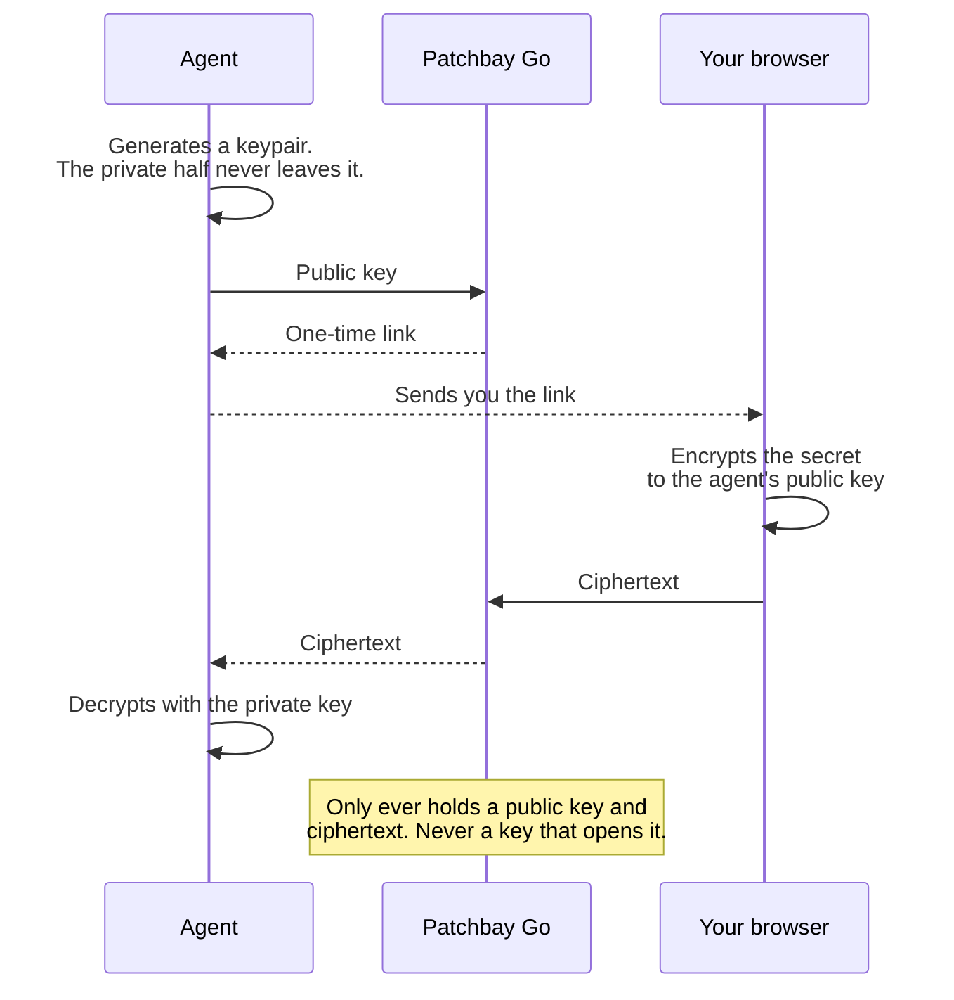

# Patchbay Go

Chat apps only linkify web links. Paste `obsidian://open?vault=Notes&file=today.md` into Telegram and it arrives as dead text. Your phone is holding a perfectly good URI it refuses to make tappable.

Patchbay Go is a tiny redirector that fixes that. Send `https://go.synodic.co/obsidian/Notes/today.md` instead: the chat app linkifies it, the tap opens a browser, and the browser, where custom schemes *are* allowed, hands off to `obsidian://`. One hop, a fraction of a second, and the app opens.


This is part of the Patchbay family of small tools that connect a phone chat app to a host that runs agents and apps, along with [Patchbay Relay](https://github.com/synodic-studio/patchbay-relay) and [Patchbay Voice](https://github.com/synodic-studio/patchbay-voice).

## Use it

There is nothing to install and no account to make. **`https://go.synodic.co` is live and open.** Build a URL and send it:

```
https://go.synodic.co/obsidian/MyVault/notes/today.md
https://go.synodic.co/things/Buy%20milk
https://go.synodic.co/cal/2026-03-14
```

Or [run your own](DEPLOYING.md), which is one file and a `wrangler` command. Then the domain is yours, the link prefix is yours, and the `/key` ciphertext sits in your own KV namespace instead of someone else's.

Worth knowing before you rely on it:

- **No auth, no logging, no state.** Every route is a pure function of the URL. The only storage anywhere is the optional KV namespace behind `/key`, and that holds ciphertext with a ten-minute TTL.
- **A wrapped link can only ever open a native app.** `/raw` refuses twelve browser-privileged schemes, `https:` among them, so a link built by someone else cannot run in your browser or quietly redirect you somewhere. [The list is short and worth reading.](#what-raw-refuses)
- **The redirect is not a guarantee the app opens.** If the target app is not installed, you land on the fallback page and nothing happens. There is no error to catch: that is the platform's behavior, not the worker's.
- **Host-agnostic.** Nothing is hardcoded to a domain; a deployment serves the same routes and advertises its own hostname.

## Screenshots

The redirect page is the entire user-facing surface of a wrapped link: it flashes by on the way into the app, and only lingers if the app is not installed. The `/key` form is the one page that asks for input.

 

## Routes

| | | |
| --- | --- | --- |
| `/obsidian/<vault>/<path>` | `/bear/<title>` | `/drafts/<text>` |
| `/ulysses/<text>` | `/things/<title>` | `/todoist/<content>` |
| `/omnifocus/<name>` | `/due/<title>` | `/remind/<title>` |
| `/cal/<yyyy-mm-dd>` | `/fantastical/<sentence>` | `/shortcuts/<name>` |
| `/telegram/<username>` | `/whatsapp/<phone>` | `/x/<handle>` |
| `/instagram/<username>` | `/googlemaps/<query>` | `/waze/<address>` |
| `/zoom/<meeting-id>` | `/raw/<base64url>` | `/key/<uuid>` |
| `/music` | `/podcasts` | `/overcast` |
| `/soundcloud` | `/slack` | `/discord` |
| `/reddit` | `/linkedin` | |

The value is URI-encoded for you, so `/things/Buy%20milk` is all a caller writes. The eight one-word routes take no value at all; they just open the app.

Four are worth a word:

- `/cal/` takes a date and optionally a time, as `/cal/2026-03-14/09:30`.
- `/fantastical/` takes plain language, so `/fantastical/Lunch%20with%20Sam%201pm` becomes an event.
- `/raw/` takes the base64url of an entire URI, for any scheme with no named route.
- `/key/` is the encrypted paste form.

### What `/raw` refuses

`/raw` takes a URI from whoever built the link, so it checks the scheme before emitting anything. These twelve are rejected with a 400:

| Runs or reads inside the browser | Never leaves the browser |
| --- | --- |
| `javascript:`<br>`vbscript:`<br>`data:`<br>`blob:`<br>`file:`<br>`filesystem:`<br>`about:`<br>`view-source:` | `http:`<br>`https:`<br>`ws:`<br>`wss:` |

The first column is the obvious half: those schemes execute script or read local content, so a wrapped link could do something in your browser rather than hand off to an app.

The second column is the one people miss. Refusing `http:` and `https:` is what keeps `/raw` from being an open redirect. Without it, anyone could publish `go.synodic.co/raw/<base64 of https://evil.example>` and their phishing link would be wearing this domain.

It is a denylist, matched case-insensitively against the scheme before the first colon, so it is only ever as complete as the browser's own set of privileged schemes. Everything after the scheme is escaped rather than trusted, so a payload that tries to break out of the redirect page cannot.

## `/key`: handing over a secret with zero knowledge

An agent needs an API key that only you have. Pasting it into the chat leaves it in the chat history forever, and every other quick way just picks a different log to leave it in.

`/key` passes it instead. The agent asks for a secret and gets back a one-time link. You open it, paste, and the page encrypts in your browser before anything is sent. This service is oblivious by construction: it only ever holds ciphertext, it holds no key that opens it, and there is no setting that could change that.



[SECRET-HANDOFF.md](SECRET-HANDOFF.md) has the protocol, the reference client, and the limits.

## Agent hosts

Export the URL prefix on the host so agents pick it up:

```bash
export PATCHBAY_URL_WRAPPER="https://go.synodic.co"
```

Agent code that builds links reads this prefix and emits `${PATCHBAY_URL_WRAPPER}/obsidian/<vault>/<path>` instead of raw `obsidian://` URIs.

## License

MIT.
